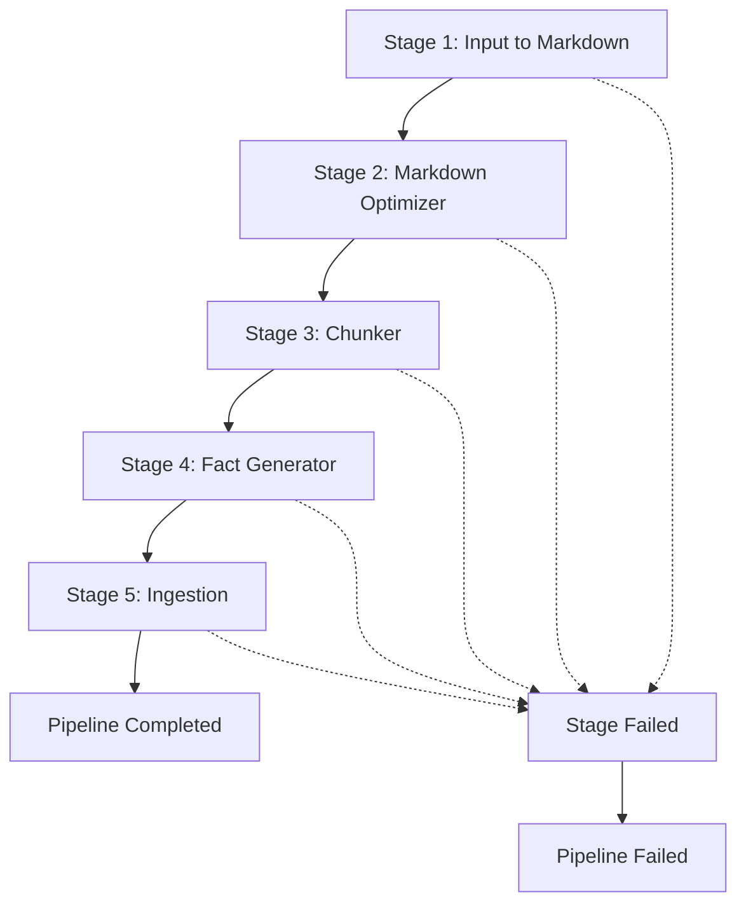

# MoRAG Webhook Integration Guide

## Table of Contents

1. [Overview](#overview)
2. [Webhook Types](#webhook-types)
3. [Quick Start](#quick-start)
4. [Webhook Schemas](#webhook-schemas)
   - [Stage-Based Webhooks](#stage-based-webhooks)
   - [Step Progress Webhooks](#step-progress-webhooks)
5. [API Endpoints](#api-endpoints)
6. [Testing & Validation](#testing--validation)
7. [Implementation Examples](#implementation-examples)
8. [Database Integration Examples](#database-integration-examples)
9. [Error Handling & Monitoring](#error-handling--monitoring)
10. [Configuration](#configuration)
11. [Security Considerations](#security-considerations)
12. [Troubleshooting](#troubleshooting)
13. [Support](#support)

## Overview

MoRAG provides comprehensive webhook notifications for document processing lifecycle events, enabling real-time monitoring of stage execution, step progress, and pipeline completion. This guide covers all webhook types, their schemas, and implementation examples for consumer applications.

### Key Features
- **Real-time Stage Updates**: Get notified when individual stages complete with detailed execution data
- **Step Progress Tracking**: Monitor individual processing steps with progress percentages
- **Pipeline Completion**: Receive comprehensive summaries when entire pipelines finish
- **Reliable Delivery**: Automatic retry logic with exponential backoff
- **Flexible Authentication**: Optional bearer token support
- **File Management**: Download URLs for all intermediate and output files

## Webhook Types

MoRAG supports three main categories of webhooks:

### 1. Stage-Based Webhooks
- **Stage Completed**: Individual stage completion with execution details and output files
- **Pipeline Completed**: Complete pipeline execution summary with all stages

### 2. Step Progress Webhooks
- **Step Started**: Individual processing step initiation
- **Step Completed**: Step completion with step-specific data
- **Step Failed**: Step-level failure notifications

### Webhook Reference Table

| Event Type | Trigger | Stage Number | Key Data |
|------------|---------|--------------|----------|
| `stage_completed` | Individual stage finishes | 1-5 | `stage.type`, `files.output_files`, `execution_time` |
| `pipeline_completed` | All stages finish | N/A | `pipeline.success`, `stages[]`, `total_execution_time` |
| **Step Events** | **Processing Step** | **Progress %** | **Specific Data** |
| `step_started` | Step begins | Variable | `step`, `status: "started"`, `progress_percent` |
| `step_completed` | Step finishes | Variable | `step`, `status: "completed"`, `data` |
| `step_failed` | Step fails | Variable | `step`, `status: "failed"`, `error_message` |

### Stage Types and Numbers

| Stage Number | Stage Type | Description |
|--------------|------------|-------------|
| 1 | `input_to_markdown` | Convert input files to markdown format |
| 2 | `markdown_optimizer` | Optimize and clean markdown content |
| 3 | `chunker` | Split content into manageable chunks |
| 4 | `fact_generator` | Extract facts and entities from content |
| 5 | `ingestion` | Store processed data in databases |

### Processing Flow



## Quick Start

### 1. Start the Webhook Receiver (for testing)

```bash
python webhook_receiver.py
```

This starts a simple webhook receiver on `http://localhost:8001/webhook`

### 2. Submit a Task with Webhook

```bash
curl -X POST "http://localhost:8000/api/v1/ingest/file" \
  -H "Authorization: Bearer test-api-key" \
  -F "source_type=document" \
  -F "file=@your-document.pdf" \
  -F "webhook_url=http://localhost:8001/webhook"
```

### 3. Monitor Webhooks

Visit `http://localhost:8001/webhooks` to see all received webhook notifications.

## API Endpoints

### Status Tracking

#### Get Task Status
```http
GET /api/v1/status/{task_id}
Authorization: Bearer {api_key}
```

#### Get Task History
```http
GET /api/v1/status/{task_id}/history
Authorization: Bearer {api_key}
```

#### Get Recent Events
```http
GET /api/v1/status/events/recent?hours=24
Authorization: Bearer {api_key}
```

## Webhook Schemas

All webhooks follow consistent structures based on the type of notification being sent.

### Stage-Based Webhooks

#### 1. Stage Completed
Sent when an individual stage completes successfully.

```json
{
  "event": "stage_completed",
  "timestamp": "2024-01-01T10:01:00Z",
  "stage": {
    "type": 1,
    "status": "completed",
    "execution_time": 15.5,
    "start_time": "2024-01-01T10:00:30Z",
    "end_time": "2024-01-01T10:01:00Z",
    "error_message": null
  },
  "files": {
    "input_files": ["/path/to/input.pdf"],
    "output_files": ["/tmp/morag/stage_1_output.md"]
  },
  "context": {
    "source_path": "/path/to/input.pdf",
    "output_dir": "/tmp/morag/output",
    "total_stages_completed": 1,
    "total_stages_failed": 0
  },
  "metadata": {
    "config_used": {
      "chunk_size": 4000,
      "overlap": 200
    },
    "metrics": {
      "pages_processed": 15,
      "content_length": 52428
    },
    "warnings": []
  }
}
```

#### 2. Pipeline Completed
Sent when the entire pipeline completes (successfully or with failures).

```json
{
  "event": "pipeline_completed",
  "timestamp": "2024-01-01T10:05:00Z",
  "pipeline": {
    "success": true,
    "error_message": null,
    "total_execution_time": 45.2,
    "stages_completed": 5,
    "stages_failed": 0,
    "stages_skipped": 0
  },
  "context": {
    "source_path": "/path/to/input.pdf",
    "output_dir": "/tmp/morag/output",
    "intermediate_files": [
      "/tmp/morag/stage_1_output.md",
      "/tmp/morag/stage_2_output.md",
      "/tmp/morag/stage_3_output.json",
      "/tmp/morag/stage_4_output.json"
    ]
  },
  "stages": [
    {
      "type": 1,
      "status": "completed",
      "execution_time": 15.5,
      "output_files": ["/tmp/morag/stage_1_output.md"],
      "error_message": null
    },
    {
      "type": 2,
      "status": "completed",
      "execution_time": 8.3,
      "output_files": ["/tmp/morag/stage_2_output.md"],
      "error_message": null
    },
    {
      "type": 3,
      "status": "completed",
      "execution_time": 12.1,
      "output_files": ["/tmp/morag/stage_3_output.json"],
      "error_message": null
    },
    {
      "type": 4,
      "status": "completed",
      "execution_time": 18.7,
      "output_files": ["/tmp/morag/stage_4_output.json"],
      "error_message": null
    },
    {
      "type": 5,
      "status": "completed",
      "execution_time": 9.4,
      "output_files": [],
      "error_message": null
    }
  ]
}
```

### Step Progress Webhooks

These webhooks provide detailed progress for individual processing steps within the MoRAG API processing tasks.

#### Base Step Webhook Schema

```typescript
interface StepWebhook {
  task_id: string;              // Background task ID
  document_id?: string;         // Document ID if provided
  step: string;                 // Processing step name
  status: "started" | "completed" | "failed";
  progress_percent: number;     // Overall progress (0-100)
  timestamp: string;            // ISO8601 timestamp
  data?: object;               // Step-specific data
  error_message?: string;      // Error message if failed
}
```

#### 1. Metadata Extraction

**Step Started:**
```json
{
  "task_id": "task-abc-123-def",
  "document_id": "my-document-456",
  "step": "metadata_extraction",
  "status": "started",
  "progress_percent": 25.0,
  "timestamp": "2024-01-15T10:30:00Z"
}
```

**Step Completed:**
```json
{
  "task_id": "task-abc-123-def",
  "document_id": "my-document-456",
  "step": "metadata_extraction",
  "status": "completed",
  "progress_percent": 40.0,
  "timestamp": "2024-01-15T10:31:00Z",
  "data": {
    "metadata_file_url": "/api/files/temp/task-abc-123-def/metadata.json",
    "metadata": {
      "title": "Machine Learning Fundamentals",
      "author": "Dr. Jane Smith",
      "creation_date": "2024-01-10",
      "format": "application/pdf",
      "language": "en",
      "page_count": 15,
      "file_size_bytes": 1048576
    }
  }
}
```

#### 2. Content Processing

**Step Completed:**
```json
{
  "task_id": "task-abc-123-def",
  "document_id": "my-document-456",
  "step": "content_processing",
  "status": "completed",
  "progress_percent": 70.0,
  "timestamp": "2024-01-15T10:33:00Z",
  "data": {
    "summary": "This document covers fundamental concepts in machine learning including supervised learning, neural networks, and optimization techniques...",
    "content_length": 52428,
    "language": "en",
    "detected_topics": [
      "machine learning",
      "neural networks",
      "optimization",
      "supervised learning"
    ],
    "processing_time_seconds": 8.7
  }
}
```

#### 3. Ingestion

**Step Completed:**
```json
{
  "task_id": "task-abc-123-def",
  "document_id": "my-document-456",
  "step": "ingestion",
  "status": "completed",
  "progress_percent": 100.0,
  "timestamp": "2024-01-15T10:36:00Z",
  "data": {
    "chunks_processed": 89,
    "total_text_length": 52428,
    "database_collection": "morag_documents",
    "processing_time_seconds": 45.2
  }
}
```

#### Step Failed Example

```json
{
  "task_id": "task-abc-123-def",
  "document_id": "my-document-456",
  "step": "processing",
  "status": "failed",
  "progress_percent": 10.0,
  "timestamp": "2024-01-15T10:30:30Z",
  "error_message": "Unsupported file format: .xyz files cannot be processed"
}
```

### Stage Failed Example

```json
{
  "event": "stage_completed",
  "timestamp": "2024-01-01T10:01:00Z",
  "stage": {
    "type": 1,
    "status": "failed",
    "execution_time": 5.2,
    "start_time": "2024-01-01T10:00:30Z",
    "end_time": "2024-01-01T10:01:00Z",
    "error_message": "Unsupported file format: .xyz files cannot be converted to markdown"
  },
  "files": {
    "input_files": ["/path/to/input.xyz"],
    "output_files": []
  },
  "context": {
    "source_path": "/path/to/input.xyz",
    "output_dir": "/tmp/morag/output",
    "total_stages_completed": 0,
    "total_stages_failed": 1
  },
  "metadata": {
    "config_used": {},
    "metrics": {},
    "warnings": ["Unsupported file format detected"]
  }
}
```

## Configuration

### Environment Variables

```bash
# Webhook settings
WEBHOOK_TIMEOUT=30          # Timeout in seconds
WEBHOOK_MAX_RETRIES=3       # Number of retry attempts
WEBHOOK_RETRY_DELAY=5       # Base delay between retries
```

### Webhook URL Requirements

- Must be a valid HTTP/HTTPS URL
- Should respond with 2xx status code for success
- Timeout: 30 seconds (configurable)
- Content-Type: application/json

## Testing & Validation

### Webhook Testing Tools

#### 1. Simple Test Server

```python
# test_webhook_server.py
from flask import Flask, request, jsonify
import json
from datetime import datetime

app = Flask(__name__)
received_webhooks = []

@app.route('/webhook', methods=['POST'])
def test_webhook():
    payload = request.json
    received_webhooks.append({
        'payload': payload,
        'received_at': datetime.now().isoformat(),
        'headers': dict(request.headers)
    })

    print(f"Received webhook: {payload.get('event_type')} for task {payload.get('data', {}).get('task_id')}")
    return jsonify({'status': 'received'})

@app.route('/webhooks', methods=['GET'])
def list_webhooks():
    return jsonify(received_webhooks)

@app.route('/webhooks/clear', methods=['POST'])
def clear_webhooks():
    received_webhooks.clear()
    return jsonify({'status': 'cleared'})

if __name__ == '__main__':
    app.run(host='0.0.0.0', port=8001, debug=True)
```

#### 2. Webhook Validator

```python
# webhook_validator.py
import json
import jsonschema
from typing import Dict, Any, List

# JSON Schema for webhook validation
STAGE_WEBHOOK_SCHEMA = {
    "type": "object",
    "required": ["event", "timestamp"],
    "properties": {
        "event": {"type": "string", "enum": ["stage_completed", "pipeline_completed"]},
        "timestamp": {"type": "string", "format": "date-time"},
        "stage": {
            "type": "object",
            "properties": {
                "type": {"type": "integer"},
                "status": {"type": "string"},
                "execution_time": {"type": "number"},
                "error_message": {"type": ["string", "null"]}
            }
        },
        "pipeline": {
            "type": "object",
            "properties": {
                "success": {"type": "boolean"},
                "total_execution_time": {"type": "number"},
                "stages_completed": {"type": "integer"},
                "stages_failed": {"type": "integer"}
            }
        },
        "files": {
            "type": "object",
            "properties": {
                "input_files": {"type": "array", "items": {"type": "string"}},
                "output_files": {"type": "array", "items": {"type": "string"}}
            }
        },
        "context": {
            "type": "object",
            "properties": {
                "source_path": {"type": "string"},
                "output_dir": {"type": "string"}
            }
        }
    }
}

STEP_WEBHOOK_SCHEMA = {
    "type": "object",
    "required": ["task_id", "step", "status", "progress_percent", "timestamp"],
    "properties": {
        "task_id": {"type": "string"},
        "document_id": {"type": ["string", "null"]},
        "step": {"type": "string"},
        "status": {"type": "string", "enum": ["started", "completed", "failed"]},
        "progress_percent": {"type": "number", "minimum": 0, "maximum": 100},
        "timestamp": {"type": "string", "format": "date-time"},
        "data": {"type": "object"},
        "error_message": {"type": ["string", "null"]}
    }
}

def validate_webhook(payload: Dict[str, Any]) -> List[str]:
    """Validate webhook payload against appropriate schema."""
    errors = []

    try:
        if 'event' in payload:
            # Stage-based webhook
            jsonschema.validate(payload, STAGE_WEBHOOK_SCHEMA)

            # Additional validation for stage webhooks
            event = payload.get('event')
            if event == 'stage_completed' and 'stage' not in payload:
                errors.append("stage_completed event must include stage information")
            elif event == 'pipeline_completed' and 'pipeline' not in payload:
                errors.append("pipeline_completed event must include pipeline information")

        elif 'task_id' in payload and 'step' in payload:
            # Step-based webhook
            jsonschema.validate(payload, STEP_WEBHOOK_SCHEMA)

            # Additional validation for step webhooks
            progress = payload.get('progress_percent', 0)
            if not 0 <= progress <= 100:
                errors.append(f"Invalid progress percentage: {progress}")

        else:
            errors.append("Webhook payload must be either stage-based or step-based")

    except jsonschema.ValidationError as e:
        errors.append(f"Schema validation error: {e.message}")

    return errors

# Usage examples
def test_stage_webhook_payload():
    test_payload = {
        "event": "stage_completed",
        "timestamp": "2024-01-15T10:30:00Z",
        "stage": {
            "type": 3,
            "status": "completed",
            "execution_time": 15.5,
            "error_message": None
        },
        "files": {
            "input_files": ["/path/to/input.md"],
            "output_files": ["/tmp/morag/stage_3_chunks.json"]
        },
        "context": {
            "source_path": "/path/to/input.pdf",
            "output_dir": "/tmp/morag/output"
        }
    }

    errors = validate_webhook(test_payload)
    if errors:
        print("Validation errors:", errors)
    else:
        print("Stage webhook payload is valid")

def test_step_webhook_payload():
    test_payload = {
        "task_id": "test-123",
        "step": "ingestion",
        "status": "completed",
        "progress_percent": 100.0,
        "timestamp": "2024-01-15T10:30:00Z",
        "data": {"chunks_processed": 25}
    }

    errors = validate_webhook(test_payload)
    if errors:
        print("Validation errors:", errors)
    else:
        print("Step webhook payload is valid")
```

#### 3. Integration Test Examples

```python
# test_webhook_integration.py
import pytest
import requests
import json
import time
from unittest.mock import patch, MagicMock

class TestWebhookIntegration:

    @pytest.fixture
    def webhook_server_url(self):
        return "http://localhost:8001/webhook"

    @pytest.fixture
    def mock_webhook_server(self):
        """Mock webhook server for testing."""
        received_webhooks = []

        def mock_post(url, json=None, **kwargs):
            response = MagicMock()
            response.status_code = 200
            response.json.return_value = {"status": "received"}
            received_webhooks.append(json)
            return response

        with patch('requests.post', side_effect=mock_post):
            yield received_webhooks

    def test_step_webhook_sequence(self, mock_webhook_server):
        """Test step-based webhook sequence."""
        from morag.services.enhanced_webhook_service import get_webhook_service

        webhook_service = get_webhook_service()
        webhook_url = "https://example.com/webhook"
        task_id = "test-task-123"

        # Test step progress
        webhook_service.send_step_completed(
            webhook_url=webhook_url,
            task_id=task_id,
            document_id="doc-456",
            step="metadata_extraction",
            progress_percent=40.0,
            data={"metadata": {"page_count": 10}}
        )

        # Test ingestion step
        webhook_service.send_step_completed(
            webhook_url=webhook_url,
            task_id=task_id,
            document_id="doc-456",
            step="ingestion",
            progress_percent=100.0,
            data={"chunks_processed": 25, "processing_time_seconds": 45.2}
        )

        # Verify webhook sequence
        assert len(mock_webhook_server) == 2

        # Verify metadata extraction webhook
        metadata_webhook = mock_webhook_server[0]
        assert metadata_webhook['step'] == 'metadata_extraction'
        assert metadata_webhook['progress_percent'] == 40.0

        # Verify ingestion webhook
        ingestion_webhook = mock_webhook_server[1]
        assert ingestion_webhook['step'] == 'ingestion'
        assert ingestion_webhook['progress_percent'] == 100.0

    def test_webhook_retry_logic(self, mock_webhook_server):
        """Test webhook retry mechanism."""
        from morag.services.enhanced_webhook_service import EnhancedWebhookService

        # Configure service with retries
        webhook_service = EnhancedWebhookService(max_retries=2, timeout_seconds=5)

        # Mock failing then succeeding requests
        call_count = 0
        def mock_post_with_failures(url, **kwargs):
            nonlocal call_count
            call_count += 1

            response = MagicMock()
            if call_count <= 2:  # First two calls fail
                response.status_code = 500
            else:  # Third call succeeds
                response.status_code = 200
                response.json.return_value = {"status": "received"}

            return response

        with patch('requests.post', side_effect=mock_post_with_failures):
            result = webhook_service.send_step_completed(
                webhook_url="https://example.com/webhook",
                task_id="test-retry",
                document_id="doc-123",
                step="ingestion",
                progress_percent=100.0,
                data={"chunks_processed": 25}
            )

            assert result is True  # Should eventually succeed
            assert call_count == 3  # Should have made 3 attempts

### Run Integration Tests
```bash
pytest tests/integration/test_webhooks.py -v
```

### Manual Testing Commands

```bash
# Terminal 1: Start webhook test server
python test_webhook_server.py

# Terminal 2: Start MoRAG API
python -m uvicorn src.morag.main:app --reload

# Terminal 3: Test webhook with stage-based processing
curl -X POST "http://localhost:8000/api/v1/stages/execute" \
  -H "Authorization: Bearer test-api-key" \
  -F "file=@test-document.pdf" \
  -F 'webhook_config={"url":"http://localhost:8001/webhook"}' \
  -F 'stages=[1,2,3,4,5]'

# Terminal 4: Test webhook with step-based processing
curl -X POST "http://localhost:8000/api/v1/process" \
  -H "Authorization: Bearer test-api-key" \
  -F "file=@test-document.pdf" \
  -F 'request_data={"mode":"ingest","webhook_config":{"url":"http://localhost:8001/webhook"}}'

# Terminal 5: Monitor received webhooks
curl http://localhost:8001/webhooks | jq '.'
```

## Security Considerations

### Webhook Security
- Use HTTPS URLs in production
- Implement webhook signature verification
- Validate webhook payloads
- Rate limit webhook endpoints

### API Security
- Always use API keys for authentication
- Restrict webhook URLs to trusted domains
- Monitor webhook delivery failures

## Troubleshooting

### Common Issues

#### Webhook Not Received
1. Check if webhook URL is accessible
2. Verify webhook endpoint returns 2xx status
3. Check MoRAG logs for delivery errors
4. Ensure firewall allows outbound connections

#### Task Status Not Updating
1. Verify Redis is running and accessible
2. Check Celery worker status
3. Review task logs for errors

#### History Not Available
1. Confirm Redis connection
2. Check if task ID is correct
3. Verify history retention settings

### Debug Commands

```bash
# Check webhook delivery logs
docker logs morag-api | grep webhook

# Check Redis status history
redis-cli keys "task_history:*"

# Check Celery task status
celery -A morag.core.celery_app inspect active
```

## Production Deployment

### Recommended Setup
- Use HTTPS for webhook URLs
- Implement webhook signature verification
- Set up monitoring for webhook delivery failures
- Configure appropriate retry policies
- Use Redis Cluster for high availability

### Monitoring
- Track webhook delivery success rates
- Monitor task completion times
- Alert on high failure rates
- Log webhook response times

## Examples

### n8n Integration
```javascript
// n8n webhook node configuration
{
  "httpMethod": "POST",
  "path": "morag-webhook",
  "responseMode": "responseNode",
  "options": {}
}
```

### Zapier Integration
```javascript
// Zapier webhook trigger
{
  "url": "https://hooks.zapier.com/hooks/catch/123456/abcdef/",
  "method": "POST",
  "headers": {
    "Content-Type": "application/json"
  }
}
```

## Implementation Examples

### TypeScript/JavaScript Consumer

```typescript
interface StageWebhookPayload {
  event: "stage_completed" | "pipeline_completed";
  timestamp: string;
  stage?: {
    type: number;
    status: string;
    execution_time: number;
    error_message?: string;
  };
  pipeline?: {
    success: boolean;
    total_execution_time: number;
    stages_completed: number;
    stages_failed: number;
  };
  files?: {
    input_files: string[];
    output_files: string[];
  };
  context: {
    source_path: string;
    output_dir: string;
  };
}

interface StepWebhookPayload {
  task_id: string;
  document_id?: string;
  step: string;
  status: "started" | "completed" | "failed";
  progress_percent: number;
  timestamp: string;
  data?: any;
  error_message?: string;
}

// Express.js webhook handler
app.post('/webhook', (req: Request, res: Response) => {
  const payload = req.body;

  if (payload.event) {
    // Stage-based webhook
    handleStageWebhook(payload as StageWebhookPayload);
  } else if (payload.task_id && payload.step) {
    // Step-based webhook
    handleStepWebhook(payload as StepWebhookPayload);
  }

  res.json({ status: 'received' });
});

function handleStageWebhook(payload: StageWebhookPayload) {
  if (payload.event === 'stage_completed') {
    console.log(`Stage ${payload.stage?.type} completed in ${payload.stage?.execution_time}s`);
    // Process stage completion, download files, etc.
  } else if (payload.event === 'pipeline_completed') {
    console.log(`Pipeline completed: ${payload.pipeline?.success ? 'SUCCESS' : 'FAILED'}`);
    console.log(`Total time: ${payload.pipeline?.total_execution_time}s`);
    // Process final results
  }
}

function handleStepWebhook(payload: StepWebhookPayload) {
  console.log(`Step ${payload.step} ${payload.status} - ${payload.progress_percent}%`);
  if (payload.status === 'failed') {
    console.error(`Step failed: ${payload.error_message}`);
  }
  // Update progress bar, log progress, etc.
}
```

### Python Flask Consumer

```python
from flask import Flask, request, jsonify
import logging

app = Flask(__name__)
logger = logging.getLogger(__name__)

@app.route('/webhook', methods=['POST'])
def handle_webhook():
    payload = request.json

    try:
        if 'event' in payload:
            # Stage-based webhook
            handle_stage_webhook(payload)
        elif 'task_id' in payload and 'step' in payload:
            # Step-based webhook
            handle_step_webhook(payload)

        return jsonify({'status': 'received'})

    except Exception as e:
        logger.error(f"Webhook processing error: {e}")
        return jsonify({'status': 'error', 'message': str(e)}), 500

def handle_stage_webhook(payload):
    event = payload['event']
    timestamp = payload['timestamp']

    if event == 'stage_completed':
        stage = payload['stage']
        stage_type = stage['type']
        status = stage['status']
        execution_time = stage['execution_time']

        logger.info(f"Stage {stage_type} {status} in {execution_time}s")

        if status == 'completed':
            # Process output files
            output_files = payload['files']['output_files']
            for file_path in output_files:
                logger.info(f"Output file available: {file_path}")
                # Download and process file

        elif status == 'failed':
            error_message = stage.get('error_message', 'Unknown error')
            logger.error(f"Stage {stage_type} failed: {error_message}")

    elif event == 'pipeline_completed':
        pipeline = payload['pipeline']
        success = pipeline['success']
        total_time = pipeline['total_execution_time']
        stages_completed = pipeline['stages_completed']

        logger.info(f"Pipeline completed: {success}, {stages_completed} stages, {total_time}s")

        if success:
            # Process all stage results
            stages = payload['stages']
            for stage in stages:
                logger.info(f"Stage {stage['type']}: {stage['status']}")
        else:
            error_message = pipeline.get('error_message', 'Unknown error')
            logger.error(f"Pipeline failed: {error_message}")

def handle_step_webhook(payload):
    task_id = payload['task_id']
    step = payload['step']
    status = payload['status']
    progress = payload['progress_percent']

    logger.info(f"Task {task_id} - {step} {status} ({progress}%)")

    if status == 'completed' and 'data' in payload:
        step_data = payload['data']
        # Process step-specific data
        if step == 'metadata_extraction':
            handle_metadata_extraction(step_data)
        elif step == 'ingestion':
            handle_ingestion_complete(step_data)
    elif status == 'failed':
        error_message = payload.get('error_message', 'Unknown error')
        logger.error(f"Step {step} failed: {error_message}")

def handle_metadata_extraction(data):
    metadata_url = data.get('metadata_file_url')
    metadata = data.get('metadata', {})
    logger.info(f"Metadata extraction complete: {metadata.get('page_count', 0)} pages")

def handle_ingestion_complete(data):
    chunks = data.get('chunks_processed', 0)
    total_length = data.get('total_text_length', 0)
    logger.info(f"Ingestion complete: {chunks} chunks, {total_length} characters")
```

### Go Consumer

```go
package main

import (
    "encoding/json"
    "fmt"
    "log"
    "net/http"
)

type StageWebhookPayload struct {
    Event     string                 `json:"event"`
    Timestamp string                 `json:"timestamp"`
    Stage     *StageInfo             `json:"stage,omitempty"`
    Pipeline  *PipelineInfo          `json:"pipeline,omitempty"`
    Files     *FileInfo              `json:"files,omitempty"`
    Context   map[string]interface{} `json:"context"`
}

type StageInfo struct {
    Type          int     `json:"type"`
    Status        string  `json:"status"`
    ExecutionTime float64 `json:"execution_time"`
    ErrorMessage  *string `json:"error_message,omitempty"`
}

type PipelineInfo struct {
    Success            bool    `json:"success"`
    TotalExecutionTime float64 `json:"total_execution_time"`
    StagesCompleted    int     `json:"stages_completed"`
    StagesFailed       int     `json:"stages_failed"`
}

type FileInfo struct {
    InputFiles  []string `json:"input_files"`
    OutputFiles []string `json:"output_files"`
}

type StepWebhookPayload struct {
    TaskID          string                 `json:"task_id"`
    DocumentID      *string                `json:"document_id,omitempty"`
    Step            string                 `json:"step"`
    Status          string                 `json:"status"`
    ProgressPercent float64                `json:"progress_percent"`
    Timestamp       string                 `json:"timestamp"`
    Data            map[string]interface{} `json:"data,omitempty"`
    ErrorMessage    *string                `json:"error_message,omitempty"`
}

func webhookHandler(w http.ResponseWriter, r *http.Request) {
    var rawPayload map[string]interface{}
    if err := json.NewDecoder(r.Body).Decode(&rawPayload); err != nil {
        http.Error(w, "Invalid JSON", http.StatusBadRequest)
        return
    }

    if event, exists := rawPayload["event"]; exists {
        // Stage-based webhook
        var payload StageWebhookPayload
        if err := json.Unmarshal(r.Body, &payload); err == nil {
            handleStageWebhook(payload)
        }
    } else if taskID, exists := rawPayload["task_id"]; exists {
        // Step-based webhook
        var payload StepWebhookPayload
        if err := json.Unmarshal(r.Body, &payload); err == nil {
            handleStepWebhook(payload)
        }
    }

    w.Header().Set("Content-Type", "application/json")
    json.NewEncoder(w).Encode(map[string]string{"status": "received"})
}

func handleStageWebhook(payload StageWebhookPayload) {
    if payload.Event == "stage_completed" && payload.Stage != nil {
        log.Printf("Stage %d %s in %.1fs",
            payload.Stage.Type,
            payload.Stage.Status,
            payload.Stage.ExecutionTime)

        if payload.Files != nil {
            for _, file := range payload.Files.OutputFiles {
                log.Printf("Output file: %s", file)
            }
        }
    } else if payload.Event == "pipeline_completed" && payload.Pipeline != nil {
        log.Printf("Pipeline completed: %t, %d stages, %.1fs",
            payload.Pipeline.Success,
            payload.Pipeline.StagesCompleted,
            payload.Pipeline.TotalExecutionTime)
    }
}

func handleStepWebhook(payload StepWebhookPayload) {
    log.Printf("Task %s - %s %s (%.1f%%)",
        payload.TaskID,
        payload.Step,
        payload.Status,
        payload.ProgressPercent)

    if payload.Status == "failed" && payload.ErrorMessage != nil {
        log.Printf("Step failed: %s", *payload.ErrorMessage)
    }
}

func main() {
    http.HandleFunc("/webhook", webhookHandler)
    log.Println("Webhook server starting on :8080")
    log.Fatal(http.ListenAndServe(":8080", nil))
}
```

### Webhook Security & Validation

```python
import hmac
import hashlib
from flask import request, abort

def validate_webhook_signature(payload, signature, secret):
    """Validate webhook signature for security."""
    expected_signature = hmac.new(
        secret.encode('utf-8'),
        payload,
        hashlib.sha256
    ).hexdigest()

    return hmac.compare_digest(f"sha256={expected_signature}", signature)

@app.route('/webhook', methods=['POST'])
def secure_webhook():
    # Validate signature if provided
    signature = request.headers.get('X-MoRAG-Signature')
    if signature and WEBHOOK_SECRET:
        if not validate_webhook_signature(request.data, signature, WEBHOOK_SECRET):
            abort(401)

    # Process webhook...
    return jsonify({'status': 'received'})
```

## Database Integration Examples

### Storing Webhook Events

```python
from sqlalchemy import create_engine, Column, String, DateTime, Text, Float
from sqlalchemy.ext.declarative import declarative_base
from sqlalchemy.orm import sessionmaker
from datetime import datetime

Base = declarative_base()

class WebhookEvent(Base):
    __tablename__ = 'webhook_events'

    id = Column(String, primary_key=True)
    task_id = Column(String, nullable=False, index=True)
    event_type = Column(String, nullable=False)
    step = Column(String, nullable=True)
    status = Column(String, nullable=False)
    progress_percent = Column(Float, nullable=True)
    timestamp = Column(DateTime, nullable=False)
    data = Column(Text, nullable=True)  # JSON data
    error_message = Column(Text, nullable=True)

def store_webhook_event(payload):
    """Store webhook event in database."""
    event = WebhookEvent(
        id=f"{payload['data']['task_id']}_{int(time.time())}",
        task_id=payload['data']['task_id'],
        event_type=payload['event_type'],
        step=payload['data'].get('step'),
        status=payload['data']['status'],
        progress_percent=payload['data'].get('progress_percent'),
        timestamp=datetime.fromisoformat(payload['timestamp'].replace('Z', '+00:00')),
        data=json.dumps(payload['data'].get('data')),
        error_message=payload['data'].get('error_message')
    )

    session.add(event)
    session.commit()
```

### Real-time Updates with WebSockets

```javascript
// Client-side WebSocket for real-time updates
const socket = io();

// Handle webhook data forwarded via WebSocket
socket.on('webhook_update', (data) => {
    if (data.event === 'stage_completed') {
        updateStageProgress(data.stage.type, data.stage.status);
        if (data.stage.status === 'completed') {
            showStageCompletion(data.stage.type, data.files.output_files);
        }
    } else if (data.event === 'pipeline_completed') {
        showPipelineCompletion(data.pipeline.success, data.pipeline.total_execution_time);
    } else if (data.step) {
        // Step-based webhook
        updateProgressBar(data.progress_percent);
        updateStatusMessage(`${data.step} ${data.status}`);
    }
});

function updateProgressBar(percent) {
    document.getElementById('progress').style.width = `${percent}%`;
    document.getElementById('progress-text').textContent = `${percent.toFixed(1)}%`;
}

// Server-side WebSocket forwarding
app.post('/webhook', (req, res) => {
    const payload = req.body;

    // Store in database
    storeWebhookEvent(payload);

    // Forward to connected clients via WebSocket
    io.emit('task_update', payload);

    res.json({ status: 'received' });
});
```

## Error Handling & Monitoring

### Comprehensive Error Handling

```python
import logging
from datetime import datetime
from typing import Dict, Any

logger = logging.getLogger(__name__)

class WebhookProcessor:
    def __init__(self):
        self.failed_webhooks = []
        self.processing_stats = {
            'total_received': 0,
            'successful': 0,
            'failed': 0,
            'last_error': None
        }

    def process_webhook(self, payload: Dict[str, Any]) -> bool:
        """Process webhook with comprehensive error handling."""
        self.processing_stats['total_received'] += 1

        try:
            # Validate payload structure
            self._validate_payload(payload)

            # Process based on webhook type
            if 'event' in payload:
                # Stage-based webhook
                event = payload['event']
                if event == 'stage_completed':
                    self._handle_stage_completed(payload)
                elif event == 'pipeline_completed':
                    self._handle_pipeline_completed(payload)
                else:
                    raise ValueError(f"Unknown stage event: {event}")
            elif 'task_id' in payload and 'step' in payload:
                # Step-based webhook
                self._handle_step_update(payload)
            else:
                raise ValueError("Unknown webhook format")

            self.processing_stats['successful'] += 1
            logger.info(f"Successfully processed webhook: {event_type}")
            return True

        except Exception as e:
            self.processing_stats['failed'] += 1
            self.processing_stats['last_error'] = str(e)

            # Store failed webhook for retry
            self.failed_webhooks.append({
                'payload': payload,
                'error': str(e),
                'timestamp': datetime.now().isoformat(),
                'retry_count': 0
            })

            logger.error(f"Webhook processing failed: {e}", exc_info=True)
            return False

    def _validate_payload(self, payload: Dict[str, Any]):
        """Validate webhook payload structure."""
        required_fields = ['event_type', 'timestamp', 'data']
        for field in required_fields:
            if field not in payload:
                raise ValueError(f"Missing required field: {field}")

        # Validate timestamp format
        try:
            datetime.fromisoformat(payload['timestamp'].replace('Z', '+00:00'))
        except ValueError:
            raise ValueError("Invalid timestamp format")

    def retry_failed_webhooks(self, max_retries: int = 3):
        """Retry processing failed webhooks."""
        for failed_webhook in self.failed_webhooks[:]:
            if failed_webhook['retry_count'] < max_retries:
                failed_webhook['retry_count'] += 1
                if self.process_webhook(failed_webhook['payload']):
                    self.failed_webhooks.remove(failed_webhook)
```

## Webhook Event Summary

### Complete Event Sequence Examples

#### Stage-Based Processing (Recommended)
For a typical document processing pipeline, you can expect the following webhook sequence:

```
1. stage_completed (Stage 1: input_to_markdown)
2. stage_completed (Stage 2: markdown_optimizer)
3. stage_completed (Stage 3: chunker)
4. stage_completed (Stage 4: fact_generator)
5. stage_completed (Stage 5: ingestion)
6. pipeline_completed (success: true)
```

#### Step-Based Processing (Legacy API)
For the legacy processing API, you can expect:

```
1. step_started (metadata_extraction, 25%)
2. step_completed (metadata_extraction, 40%)
3. step_started (content_processing, 40%)
4. step_completed (content_processing, 70%)
5. step_started (ingestion, 90%)
6. step_completed (ingestion, 100%)
```

### Best Practices for Consumers

1. **Idempotency**: Handle duplicate webhooks gracefully
2. **Validation**: Always validate webhook payloads
3. **Error Handling**: Implement comprehensive error handling
4. **Monitoring**: Track webhook delivery success rates
5. **Security**: Use HTTPS and validate signatures in production
6. **Performance**: Process webhooks asynchronously
7. **Logging**: Log all webhook events for debugging
8. **File Management**: Download and process output files promptly

### Common Integration Patterns

- **Stage Tracking**: Monitor individual stage completion and download output files
- **Pipeline Monitoring**: Track overall pipeline success and execution times
- **Progress Tracking**: Update UI progress bars based on `progress_percent` (step webhooks)
- **File Processing**: Download and process intermediate files from each stage
- **Notification System**: Send alerts on completion or failure
- **Data Pipeline**: Trigger downstream processes on pipeline completion
- **Analytics**: Track processing times and success rates per stage
- **Debugging**: Store webhook history and stage outputs for troubleshooting

## Support

For issues or questions:
1. Check the troubleshooting section
2. Review the integration tests
3. Check MoRAG logs for detailed error messages
4. Create an issue with reproduction steps
5. Review webhook payload validation
6. Check webhook endpoint accessibility and response codes
7. Test with the provided webhook validation tools
8. Verify webhook URL is accessible from MoRAG server

### Additional Resources

- [API Usage Guide](API_USAGE_GUIDE.md) - Complete API documentation
- [Stage System Documentation](packages/morag-stages/README.md) - Stage-based processing system
- [Integration Tests](tests/integration/test_webhooks.py) - Example test implementations
- [Webhook Receiver Example](webhook_receiver.py) - Simple webhook server for testing
- [Enhanced Webhook Service](packages/morag/src/morag/services/enhanced_webhook_service.py) - Step-based webhook implementation
- [Stage Webhook Service](packages/morag-stages/src/morag_stages/webhook.py) - Stage-based webhook implementation
